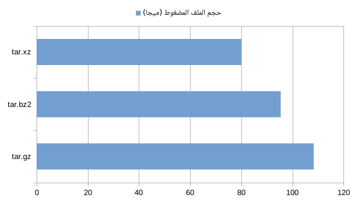
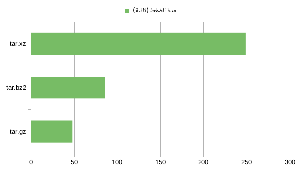
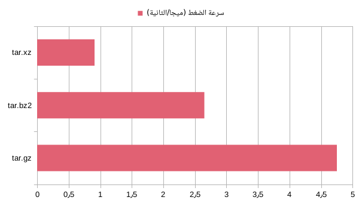
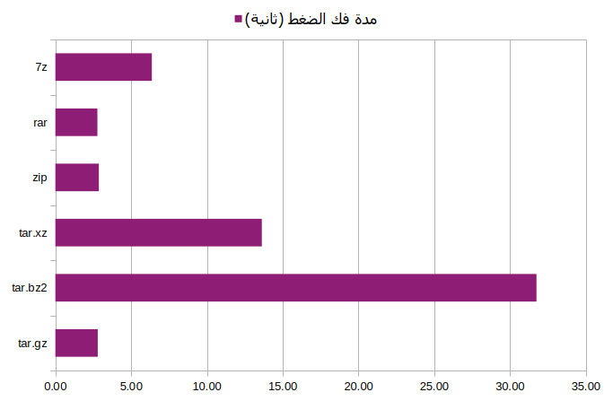
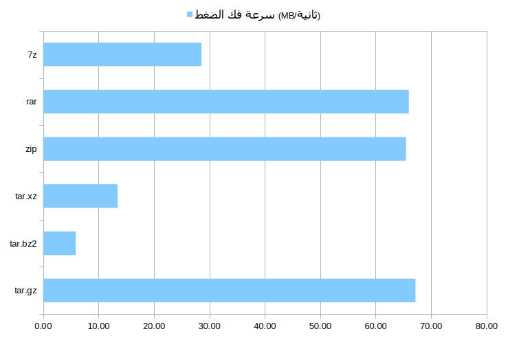
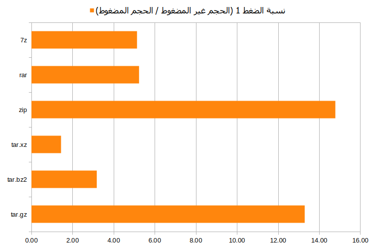
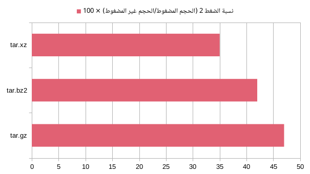

# archive and compression in linux
# أرشفة وضغط الملفات على جنو/لينكس


دليلك للتعرف على أشهر صيغ أرشفة وضغط الملفات على أنظمة جنو/لينكس مع مقارنة عملية تبين الفرق بينها.


**المحتويات** [إخفاء](#)

[مقدمة](#مقدمة)

[ماهي الأرشفة؟](#ماهي-الأرشفة)

[ماهو الضغط؟](#ماهو-الضغط)

[صيغة الأرشفة Tar](#صيغة-الأرشفة-tar)

[صيغ الضغط](#صيغ-الضغط)

[صيغة الضغط Gzip](#صيغة-الضغط-gzip)

[صيغة الضغط Bzip2](#صيغة-الضغط-bzip2)

[صيغة الضغط Xz](#صيغة-الضغط-xz)

[الارشفة ب: zip و unzip](#-الارشفة-ب-zip-و-unzip)

[الارشفة ب: rar و unrar](#-الارشفة-ب-rar-و-unrar)

[حماية ملف rar بكلمة مرور](#-حماية-ملف-rar-بكلمة-مرور)

[أداة 7z (7zip)](#-أداة-7z-7zip)

[مقارنة عملية بين صيغ الضغط الستة](#مقارنة-عملية-بين-صيغ-الضغط-الستة)

[ تشفير وفك تشفير الملفات باستخدام (GnuPG) GPG](#%EF%B8%8Fتشفير-وفك-تشفير-الملفات-باستخدام-gnupg--gpg-)

[خاتمة](#خاتمة)

## مقدمة

كثير منا لديه بعض المعلومات عن أرشفة وضغط الملفات، ومن المؤكد أنك كمستخدم عادي أو متقدم لنظام لينكس قد صادفت أو حملت أرشيفا مضغوطا على نظامك، أو أنك تريد أرشفة وضغط الملفات لجمعها في ملف واحد، أو لتوفير بعض المساحة على وسائط التخزين الخاصة بك، أو لتسريع عملية نسخها. سنتعرض في هذا المقال لأشهر الصيغ الحرة ومفتوحة المصدر لأرشفة وضغط الملفات، ونبين الفرق بينها مع طريقة إنشاء الملفات المؤرشفة والمضغوطة وطريقة فك أرشفتها وضغطها عبر سطر الأوامر. لكن قبل ذلك علينا أن نعَرِّف كلا من مصطلحي الأرشفة والضغط.

## ماهي الأرشفة؟

هي تجميع العديد من الملفات في ملف واحد بغرض عمل نسخة من هذه الملفات وتخزينها احتياطا.

## ماهو الضغط؟

هو استعمال عدة خوارزميات مختلفة لتقليل وتصغير حجم الملفات بغرض توفير مساحة تخزينية إضافية.

## صيغة الأرشفة Tar

هي المسؤولة عن أرشفة الملفات. يتمثل عملها في تجميع جميع الملفات التي يُراد أرشفتها في ملف واحد.  
**تذكر** : هذا الأمر لا يضغط الملفات وإنما يجمعها في ملف واحد فقط.

لأرشفة محتويات مجلد معين باستعمال **tar** نستعمل الأمر التالي:

```bash
tar -cvf archive.tar folder/
```

لأرشفة ملف أو عدة ملفات باستعمال **tar** نستعمل الأمر التالي:

```bash
tar -cvf archive.tar file1 file2 file3
```

الأمر c- : لإنشاء الأرشيف  
الأمر v- : لإظهار تقدم العملية  
الأمر f- : لاختيار اسم الأرشيف

لفك أرشفة أرشيف باستعمال **tar** نكتب الأمر التالي

```bash
tar -xvf archive.tar
```

او لفك أرشفة أرشيف في مسار محدد نكتب الأمر التالي

```bash
 tar -xvf archive.tar.gz -C folder/
```
الأمر x- : لفك أرشفة الأرشيف  
الأمر v- : لإظهار تقدم العملية  
الأمر f- : لتحديد الأرشيف

الأمر C- : لتحديد مجلد فك الضغط

يمكن استخدام **tar** مع صيغ الضغط بغرض أرشفة وضغط الملفات في نفس الوقت.

## صيغ الضغط

### صيغة الضغط Gzip

إختصار لكلمة **GNU Zip** وهي آلية لضغط الملفات وتصغير حجمها. يتميز هذا النوع من الضغط بسرعته وشهرته وكثرة استعماله. ويُستعمل مع **tar** لأرشفة و ضغط الملفات.

لضغط ملف أو مجلد بصيغة **tar.gz** نستعمل الأمر التالي:

```bash
tar -cvzf archive.tar.gz file-or-folder-to-compress
```

الأمر c- : لإنشاء الأرشيف  
الأمر v- : لإظهار تقدم العملية  
الأمر z- : لضغط الأرشيف بواسطة **gzip** .  
الأمر f- : لاختيار اسم الأرشيف

لفك ضغط ملف **tar.gz** نستعمل الأمر التالي:

```bash
tar -xvzf archive.tar.gz
```

او لفك أرشفة أرشيف في مسار محدد نكتب الأمر التالي

```bash
 tar -xvzf archive.tar.gz -C folder/
```
الأمر x- : لفك أرشفة وضغط الأرشيف  
الأمر v- : لإظهار تقدم العملية  
الأمر z- : لفك ضغط الأرشيف بواسطة **gzip** 

الامر C- : لتحديد مجلد فك الضغط

### صيغة الضغط Bzip2

هي آلية أخرى لضغط الملفات وتصغير حجمها. ويتميز هذا النوع من الضغط بفاعليته وقلة استعماله بسبب بطئه. ويُستعمل مع **tar** لأرشفة و ضغط الملفات.

لضغط ملف أو مجلد بصيغة **tar.bz2** نستعمل الأمر التالي:

```bash
tar -cvjf archive.tar.bz2 file-or-folder-to-compress
```

الأمر c- : لإنشاء الأرشيف  
الأمر v- : لإظهار تقدم العملية  
الأمر j- : لضغط الأرشيف بواسطة **bzip2**.  
الأمر f- : لاختيار اسم الأرشيف

لفك ضغط ملف **tar.bz2** نستعمل الأمر التالي:

```bash
tar -xvjf archive.tar.bz2
```

او لفك أرشفة أرشيف في مسار محدد نكتب الأمر التالي

```bash
 tar -xvjf archive.tar.bz2 -C folder/
```

الأمر x- : لفك أرشفة وضغط الأرشيف  
الأمر v- : لإظهار تقدم العملية  
الأمر j- : لفك ضغط الأرشيف بواسطة **bzip2** 

الامر C- : لتحديد مجلد فك الضغط

### صيغة الضغط Xz

هي آلية أخرى لضغط الملفات وتقليل حجمها. يتميز هذا النوع من الضغط بفاعليته الكبيرة أكثر من النوعين السابقين وقلة استعماله بسبب بطئه الشديد. ويُستعمل مع **tar** لأرشفة و ضغط الملفات.

لضغط ملف أو مجلد بصيغة **tar.xz** ننفذ الأمر التالي:

```bash
tar -cvJf archive.tar.xz file-or-folder-to-compress
```

الأمر c- : لإنشاء أرشيف  
الأمر v- : لإظهار تقدم العملية  
الأمر J- : لضغط الأرشيف بواسطة **xz**  
الأمر f- : لاختيار اسم الأرشيف

لفك ضغط ملف **tar.xz** ننفذ الأمر التالي:

```bash
tar -xvJf archive.tar.xz
```

او لفك أرشفة أرشيف في مسار محدد نكتب الأمر التالي

```bash
  tar -xvJf archive.tar.xz -C folder/
```

الأمر x- : لفك أرشفة وضغط الأرشيف  
الأمر v- : لإظهار تقدم العملية  
الأمر J- : لفك ضغط الأرشيف بواسطة **xz** 

الامر C- : لتحديد مجلد فك الضغط


## 📌 الارشفة ب: `zip` 
`zip` هي أداة شهيرة تدعم الأرشفة والضغط في نفس الوقت، وتُستخدم على جميع أنظمة التشغيل تقريبًا.


### 📦 ضغط مجلد أو ملف:

```bash
zip -r archive.zip folder/
```

الامر  r- : لضغط المجلدات بشكل تكراري

### 📥 فك الضغط:

```bash
unzip archive.zip
```

او لفك أرشفة أرشيف في مسار محدد نكتب الأمر التالي

```bash
unzip archive.zip -d folder/
```

الامر d- : لتحديد مجلد فك الضغط


### 🔐 حماية ملف zip بكلمة مرور:

```bash
zip -r -e archive.zip folder/
```

الامر  e- : تفعيل خاصية الحماية بكلمة مرور (سيُطلب منك إدخالها)

---
## 📌 الارشفة ب: `rar` 

صيغة RAR معروفة بقوة الضغط العالية، لكن أدواتها ليست مفتوحة المصدر، وتحتاج لتثبيت يدوي غالبًا.

### 📦 ضغط ملف أو مجلد:

```bash
rar a archive.rar folder/
```

الامر  a : لإنشاء أرشيف وإضافة الملفات إليه

### 📥 فك الضغط:

```bash
unrar x archive.rar
```

الامر x : فك الضغط مع الحفاظ على هيكل المجلدات

او لفك أرشفة أرشيف في مسار محدد نكتب الأمر التالي

```bash
 unrar x archive.rar folder/
```

> لتثبيت rar/unrar:

```bash
sudo apt install rar unrar
```

### 🔐 حماية ملف rar بكلمة مرور:

```bash
rar a -p archive.rar folder/
```

الامر  p- : لحماية الأرشيف بكلمة مرور (سيُطلب منك إدخالها)

---

### 📦 أداة 7z (7zip)

**7z** هي أداة ضغط قوية تدعم تنسيقات متعددة وتوفر نسبة ضغط عالية جدًا، وتُستخدم عادة بصيغة `.7z`.

🔹**التثبيت:**

```bash
sudo apt install p7zip-full
```

🔹 **ضغط مجلد بصيغة .7z:**

```bash
7z a archive.7z myfolder/
```

🔹 **فك الضغط:**

```bash
7z x archive.7z
```

او لفك أرشفة أرشيف في مسار محدد نكتب الأمر التالي

```bash
7z x archve.7z -ofolder/
```


🔹 **ضغط مع كلمة مرور:**

```bash
7z a -pMyPassword archive.7z myfolder/
```
*  إن لم ترد استعمال سطر الأوامر لتنفيذ العمليات السابقة فهناك العديد من البرامج الرسومية على أنظمة **جنو/لينكس.** والتي تسمح لك بتنفيذها مثل **Ark** و **File** **Roller** و **Engrampa** و **Xarchiver**.
---


## مقارنة عملية بين صيغ الضغط الستة

أجريت هذه المقارنة عبر ضغط مجلد حجمه 211,9 ميجابايت، يحتوي على عدد كبير من الملفات صغيرة الحجم (62 ملف).

مواصفات الجهاز الذي أجريت عليه المقارنة كالتالي:

-   معالج Intel(R) Core(TM) i3-4005U (4) @ 1,7 GHz
-   ذاكرة عشوائية بحجم 12 جيجابايت
-   توزيعة Linux Mint 22.1
-   نواة لينكس 6.8
-   حزم gzip 1.12, bzip2 1.0.8, xz-utils 5.6.1 , rar 2:7.0 , unrar 1:7.0 ,p7zip-full 16.02 ,gpg (GnuPG) 2.4.4


استعملت في هذه المقارنة برنامج Libreoffice Calc 24.2.7.2 و اموامر ``` time command ``` و ``` du -sh file``` وتشمل المقارنة المعطيات التالية:

-   حجم الملف المضغوط؛
-   مدة الضغط؛
-   سرعة الضغط؛
-   مدة فك الضغط؛
-   سرعة فك الضغط؛
-   نسبة الضغط.

توجد معادلتان لحساب نسبة الضغط:

-   نسبة الضغط (Compression Ratio) رقم 1 هي نتيجة المعادلة: الحجم غير المضغوط / الحجم المضغوط. هذه المعادلة تُستعمل في مدراء الأرشيف مثل **File** **Roller** و **Engrampa** و **Ark.**
-   نسبة الضغط (Compression Ratio) رقم 2 هي نتيجة المعادلة: (الحجم المضغوط / الحجم غير المضغوط) × 100. هذه المعادلة تُستعمل في مدراء الأرشيف مثل **7zip** و **Winrar**

وقد أخذت كلتا القيمتين بعين الاعتبار أثناء المقارنة.

الجدول والمنحنيات الآتية توضح المقارنة بالأرقام:

ابحث:

| الصيغة |حجم الملفات قبل الضغط (ميجا) | حجم الملف المضغوط (ميجا)|مدة الضغط (ثانية) | سرعة الضغط (ميجا/الثانية) | مدة فك الضغط (ثانية) | سرعة فك الضغط (ميجا/الثانية) | نسبة الضغط 1 (الحجم غير المضغوط/ الحجم المضغوط)|نسبة الضغط 2 (الحجم المضغوط/ الحجم غير المضغوط) × 100|
|---|---|---|---|---|---|---|---|---|
|tar.gz | 203 | 188 | 14.14 | 14.36 | 2.80 | 67.19 | 1.08 | 92.61 |
|tar.bz2 | 203 | 187 | 58.84 | 3.45 | 31.74 | 5.89 | 1.09 | 92.12 |
|tar.xz | 203 | 183 | 127.06 | 1.60 | 13.62 | 13.44 | 1.11 | 90.15 |
|zip | 203 | 188 | 12.71 | 15.97 | 2.87 | 65.48 | 1.08 | 92.61 |
|rar | 203 | 183 | 34.95 | 5.81 | 2.77 | 65.99 | 1.11 | 90.15 |
|7z | 203 |  182 | 35.43 | 5.73 | 6.37 | 28.58 | 1.12 | 89.66 |


<p align="center">
  
  
  
  
  
  
  
</p>

## 🛡️تشفير وفك تشفير الملفات باستخدام (GnuPG)  GPG :  

 أ **PGP** (Pretty Good Privacy) يُستخدم لتأمين الملفات عبر التشفير الرقمي باستخدام مفاتيح عامة وخاصة. أشهر تطبيق له على لينكس هو `gpg` 

🔹 **التثبيت (عادةً مثبت مسبقًا):**

```bash
sudo apt install gnupg2
```

### ✅ التشفير التفاعلي (بكلمة مرور):

```bash
gpg -c fichier.txt
```
الأمر `c-` استخدام التشفير المتماثل (symmetric encryption) باستخدام **كلمة مرور** بدلاً من المفتاح العام/الخاص.

ينتج ملف مشفر باسم `fichier.txt.gpg`، ويُحتفظ بالملف الأصلي.

### ✅ فك التشفير التفاعلي (يعرض المحتوى في الطرفية):

```bash
gpg -d fichier.txt.gpg
```
الأمر `d-` فك التشفير (decrypt) 
يقوم بقراءة الملف المشفر ويُظهر محتواه على الطرفية 
يجب استخدام `o-` لتحديد اسم الملف الناتج

### ✅ فك التشفير وكتابة المحتوى إلى ملف جديد:

```bash
gpg -o test.txt -d fichier.txt.gpg
```

> ملاحظة: قد لا يُطلب منك كلمة المرور إذا كان `gpg-agent` يعمل واحتفظ بها مؤقتًا.

---

### 🤖 التشفير وفك التشفير عبر سكربت (batch mode)

#### ✅ التشفير بكلمة مرور (مثال: `abc123`):

```bash
gpg --batch --passphrase abc123 -c test.txt
```
الأمر `batch--` تشغيل `gpg` في وضع غير تفاعلي (مفيد للسكريبتات)
الأمر `passphrase--` تمرير كلمة المرور مباشرة بدون الطلب من المستخدم إدخالها يدويًا 

#### ✅ فك التشفير بكلمة مرور والكتابة إلى ملف جديد:

```bash
gpg --batch --passphrase abc123 -o test.txt -d test.txt.gpg
```
--- 

🔹 **إنشاء زوج مفاتيح:**

```bash
gpg --full-generate-key
```
الأمر `full-generate-key--` توليد زوج مفاتيح (عام وخاص) 

🔹 **تشفير ملف باستخدام المفتاح العام:**

```bash
gpg -e -r "User Name" myfile.txt
```
الأمر `e-` تشفير الملف باستخدام المفتاح العام (asymmetric encryption).

الأمر `r-` تحديد اسم المستخدم  الذي سيتم استخدام مفتاحه العام للتشفير

🔹 **فك التشفير (باستخدام المفتاح الخاص):**

```bash
gpg -d myfile.txt.gpg > myfile.txt
```

🔹 **توقيع ملف رقميًا:**

```bash
gpg --sign myfile.txt
```
الأمر `sign--` توقيع الملف رقميًا باستخدام مفتاحك الخاص لإثبات أنك صاحبه


🔹 **التحقق من التوقيع:**

```bash
gpg --verify myfile.txt.gpg
```
الأمر `verfiy--` التحقق من التوقيع الرقمي، هل هو صحيح وهل الملف تم تعديله أم لا


> ✅ **ملاحظة:** PGP لا يقوم بالضغط بل بالتشفير، ويمكن دمجه مع أدوات الضغط مثل tar أو zip للحصول على أرشفة + تشفير.


## خاتمة
بعد استعراض أشهر طرق أرشفة وضغط وتشفير الملفات على أنظمة جنو/لينُكس، يمكنك الآن اختيار الطريقة المناسبة لاحتياجاتك:

- 🚀 استخدم `tar.gz` أو `zip` للضغط السريع
- 💾 استخدم `tar.xz` أو `7z` للضغط الأفضل مع التضحية بسرعة الضغط
- 🔐 استخدم `gpg` لتشفير الملفات الحساسة

تذكر أن معظم بيئات سطح المكتب في لينُكس توفر أدوات رسومية للتعامل مع هذه العمليات مثل Ark وFile Roller وEngrampa وXarchiver، والتي تسهل عليك تنفيذ نفس المهام دون الحاجة لاستخدام سطر الأوامر.


